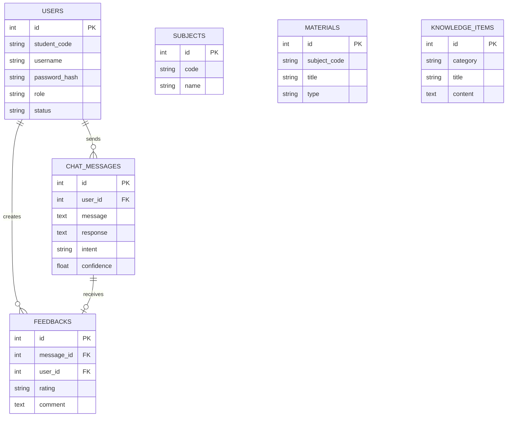

# P1-002 — Database Audit

## 1. Scope
Kiểm tra hiện trạng cơ sở dữ liệu của ứng dụng StudyBot. Bao gồm: phân loại các file CSDL, kiểm tra schema thông qua PRAGMA, lấy số lượng/trạng thái tài khoản người dùng, phân tích liên kết (relationships), kiểm tra cách khởi tạo (seeding), và đối chiếu với Spec. Toàn bộ thông tin được thu thập bằng read-only queries (SQLite) và đọc file trực tiếp mà không sửa đổi working tree hay database.

## 2. Sources Inspected
- `app/__init__.py`
- `app/models.py`
- `app/routes.py`
- `app/auth.py`
- `app/student_accounts.py`
- `app/main.py`
- `framework/src/database/db.py`
- Thư mục `instance/`
- `.gitignore`
- Dữ liệu thu thập từ `PRAGMA table_info` và SQL Count Queries.

## 3. Database Inventory
Kiểm tra trực tiếp từ đường dẫn `D:\24CT2-Vo_Thanh_Danh\`:
| Path | Tồn tại | Được source tham chiếu? | Loại | Bằng chứng |
| ---- | ------- | ----------------------- | ---- | ---------- |
| `instance/studybot.db` | CÓ | CÓ (`app/__init__.py`) | **ACTIVE** | Được Flask-SQLAlchemy dùng làm default `DATABASE_URL`. |
| `instance/studybot.db.bak`| CÓ | KHÔNG | **UNKNOWN / UNVERIFIED** | The `.bak` filename suggests a backup-like artifact, but its origin/provenance is not independently verified. Therefore it is classified as UNKNOWN/UNVERIFIED for this audit. |
| `instance/chatbot.db` | CÓ | KHÔNG | **UNKNOWN / UNVERIFIED** | Nguồn gốc không xác định. |
| `framework/src/database/chatbot.db` | KHÔNG | CÓ | **DEFINED BY SOURCE / NOT PRESENT** | Source `framework/src/database/db.py` defines this relative DB path, but no corresponding file currently exists. |

Lưu ý: Qua kiểm tra read-only inventory, file `.sqlite` và `.sqlite3` hoàn toàn không tồn tại trên hệ thống. Kiểm tra `git ls-files instance/` trả về kết quả rỗng, chứng tỏ các database artifacts trong instance/ không bị track bởi git.

## 4. Active Database
Database hiện hành (Active) cung cấp data cho hệ thống Flask web là:
- **Engine**: SQLite thông qua Flask-SQLAlchemy
- **File Path**: `instance/studybot.db`
- **Database URI**: `sqlite:///studybot.db` (trong `app/__init__.py`)

## 5. Database Configuration
Cấu hình tại `app/__init__.py`:
- `SQLALCHEMY_DATABASE_URI = os.environ.get('DATABASE_URL', 'sqlite:///studybot.db')`
- `SQLALCHEMY_TRACK_MODIFICATIONS = False`

## 6. Schema Inventory
Cấu trúc được chứng minh qua output thực tế `PRAGMA table_info` cho toàn bộ 6 bảng:
- `users`
- `subjects`
- `materials`
- `knowledge_items`
- `chat_messages`
- `feedbacks`

## 7. Model Audit
The inspected schema matches the corresponding SQLAlchemy model definitions for the inspected columns.
- Các bảng được ánh xạ chính xác về Models. Primary keys đều là `id`.
- Database có các unique indexes (`sqlite_autoindex_subjects_1`, `sqlite_autoindex_users_1`, `sqlite_autoindex_users_2`) tương ứng xác nhận constraint ở mức CSDL cho `subjects.code`, `users.student_code`, `users.username`.
- Cột `materials.subject_code` hoàn toàn không có khóa ngoại (Foreign Key). Bằng chứng `PRAGMA foreign_key_list('materials')` trả về kết quả rỗng. No database-level foreign key exists from `materials.subject_code` to `subjects`.

## 8. Student Account Audit
Dựa trên kết quả read-only SQL trực tiếp:
- **Total users**: 904
- **Total admins**: 1 (`admin`)
- **Total student rows**: 903
- **Exact Set Check**: Kiểm tra chính xác theo từng cohort (24, 25, 26) từ 0001 đến 0300.
- **Kết quả**: 900 exact student codes match the required ranges and serial numbers. (Missing: 0, Duplicate: 0).
- **Extra rows**: Tồn tại 3 extra student rows ngoài tập mong đợi là: `24CT2001`, `24CT2002`, `24CT2003`. Extra/legacy-style test accounts; provenance not independently verified.

## 9. Chat History Audit
`chat_messages` stores conversation history:
- message
- response
- intent
- confidence
- user_id
- created_at
**Not implemented**: Không có field hoặc database mechanism riêng biệt nào chứng minh tồn tại Context Memory, Context Resolver, Topic Continuity, hoặc Topic Switching. 
Do đó, current chat history persistence must not be interpreted as the planned P5 Context Memory functionality.

## 10. Feedback Audit
Bảng `feedbacks` lưu đánh giá.
- Lệnh `SELECT COUNT(*)` trả về 0. (Tính năng tồn tại nhưng chưa có data thực tế).
- Bằng chứng `PRAGMA foreign_key_list('feedbacks')` xác nhận bảng có 2 khóa ngoại hợp lệ.

## 11. Relationships
Dựa trên PRAGMA Foreign Keys:
| Parent | Child | Relationship | DB-Level FK |
| ------ | ----- | ------------ | ----------- |
| `users` | `chat_messages` | 1-N | CÓ (`chat_messages.user_id` -> `users.id`) |
| `users` | `feedbacks` | 1-N | CÓ (`feedbacks.user_id` -> `users.id`) |
| `chat_messages` | `feedbacks` | 1-1 | CÓ (`feedbacks.message_id` -> `chat_messages.id`) |
| `subjects` | `materials` | Logical/application-level association only | No DB-level FK |

## 12. Database Duplication / Legacy
- Tồn tại các file DB artifacts `chatbot.db` và `studybot.db.bak` không rõ nguồn gốc. Trạng thái unverified.

## 13. Initialization / Seed
Đọc mã nguồn `app/__init__.py` (seed_initial_data):
- **Trigger**: Called khi khởi chạy (trong `app_context`).
- **Idempotency (Student)**: Hàm `seed_student_accounts` so khớp list mã 900 account.
- **Idempotency (Materials/Knowledge)**: Check if `Subject.query.count() == 0`. Chỉ chạy nạp dữ liệu một lần. Không cập nhật lại khi JSON data thay đổi.

## 14. Migration Audit
- Requirements không có Flask-Migrate/Alembic.
- App sử dụng `db.create_all()`.
- **Status**: NOT IMPLEMENTED.

## 15. Security Audit
- `app/__init__.py` và `app/models.py` lưu mật khẩu băm thay vì text plain (chứng minh qua Werkzeug).
- `.gitignore` contains `instance/` and `*.db` patterns. Lệnh `git ls-files` và `git check-ignore` chứng minh các files CSDL không bị track.

## 16. Specification vs Implementation
| Requirement | Specification | Current Implementation | Status | Gap |
| ----------- | ------------- | ---------------------- | ------ | --- |
| 900 Student Accounts | Sinh 900 tài khoản hợp lệ | 900 exact student codes hợp lệ + 3 extra student rows. | PARTIAL | 3 extra rows ngoài tập. |
| Context Memory | Bot nhớ 10-15 câu | `chat_messages` stores conversation history | MISSING | Future/planned P5. |
| CSDL Migration | Cập nhật cấu trúc | Không framework migration. | MISSING | Chờ làm Phase tiếp. |
| Subjects & Materials| Ràng buộc tài liệu theo môn | Bảng schema thiếu Foreign Key. | PARTIAL | No DB-level FK. |

## 17. Current Database Architecture
(Cấu trúc đã được kiểm chứng bởi PRAGMA và source).

*(Lưu ý: `MATERIALS` trỏ logic về `SUBJECTS`. Logical/application-level association only; no DB-level FK).*

## 18. Planned Database Architecture
Các phase từ 8 đến 12 sẽ đưa vào:
- Embedding data.
- Vector database mapping.

## 19. Findings

### Finding 1: Extra Student Accounts
Out-of-scope / Future Note:
The audit identified three extra student rows: `24CT2001`, `24CT2002`, `24CT2003`. 
These rows are recorded only as an audit finding. P1-002 is read-only and performs no account cleanup.
Any future removal, reconciliation, migration, or retention decision must be handled by a separately scoped future task.

### Finding 2: Missing Foreign Key
- **Finding:** Bảng `materials` thiếu Foreign Key `subject_code`.
- **Evidence:** `PRAGMA foreign_key_list('materials')` rỗng.
- **Impact:** Có thể tạo tài liệu với môn học không tồn tại.
- **Out-of-scope / Future Note:** Việc bổ sung FK sẽ được xử lý khi cài đặt system migration ở phase tương lai.

### Finding 3: Seeding Logic
- **Finding:** Seed logic chỉ chạy khi DB rỗng.
- **Evidence:** Điều kiện `if Subject.query.count() == 0:` trong `app/__init__.py`.
- **Impact:** Sửa files `materials.json` thì CSDL không lấy được updates sau init lần đầu.

## 20. Technical Debt
- TD-DB-001: No database migration framework.
- TD-DB-002: Bảng `materials` mất ràng buộc dữ liệu khóa ngoại.

## 21. Limitations
- Audit 100% bằng lệnh SQLite read-only.
- Untracked artifacts (`get_evidence.py`, `p1_002_evidence.py`) có Provenance: UNVERIFIED và not counted as an intentional P1-002 documentation change.

## 22. Conclusion
Database lưu trữ đúng cấu trúc Model, tuy nhiên Schema SQLite hiện tại thiếu Foreign Key ở bảng Materials. Hệ thống có chính xác 900 student accounts theo Spec kèm 3 extra rows. Việc lưu lịch sử chat hiện tại là conversation history persistence cơ bản. Mọi phát hiện ngoài luồng sẽ được giữ nguyên trạng và chờ xử lý ở các phase kế tiếp khi được phê duyệt.
